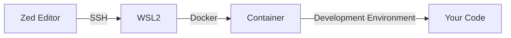

## はじめに

Zed Editorは、AtomやVS Codeの開発者たちが新たに作り出したエディタとして注目を集めています。最近になってWindows対応が発表され、話題となっています。

しかし、開発環境をセキュアに保ちたい場合、直接ホストOSで動作させるのは避けたいところ。そこで今回は、以下の選択肢を比較しながら、最終的にDocker Containerを使用した安全な開発環境の構築方法を紹介します：

- Windows直接インストール
- WSL2での実行
- Docker Container on WSL2（今回採用）

本来であればDevcontainerを使用したかったのですが、現時点（2025年10月時点）ではZedがDevcontainerに対応していないため、今回はDockerを直接使用する方法を採用しています。

## 前提環境と構成図

### 自分の環境
- Windows 11 Home
- WSL2
- Docker Engine on WSL2

### 構成図



この構成により、以下のメリットが得られます：
- 開発環境の分離
- 環境の再現性確保
- セキュリティの向上

## Containerの準備

以下のDockerfileを使用して開発環境を構築します：

```dockerfile
FROM ubuntu:22.04

# 必要なパッケージのインストール
RUN apt-get update && apt-get install -y \
    openssh-server \
    git \
    curl \
    build-essential \
    && rm -rf /var/lib/apt/lists/*

# SSHの設定
RUN mkdir /var/run/sshd
RUN echo 'PasswordAuthentication no' >> /etc/ssh/sshd_config
RUN echo 'PermitRootLogin prohibit-password' >> /etc/ssh/sshd_config

# 作業ディレクトリの作成
WORKDIR /workspace

EXPOSE 22
CMD ["/usr/sbin/sshd", "-D"]
```

コンテナのビルドと起動：

```bash
# イメージのビルド
docker build -t zed-dev-env .

# コンテナの起動
docker run -d \
  --name zed-dev \
  -v $HOME/.ssh/authorized_keys:/root/.ssh/authorized_keys:ro \
  -v $HOME/workspace:/workspace \
  -p 2222:22 \
  zed-dev-env
```

## ZedからSSHを開く

1. Zedを起動し、「Remote」→「Connect to SSH Host」を選択
2. 以下の形式でSSH設定を入力：

```
Host zed-dev
  HostName localhost
  Port 2222
  User root
  IdentityFile ~/.ssh/id_ed25519
```

3. 接続後、`/workspace`ディレクトリが表示され、開発を開始できます。

## まとめと感想

### Zed + Dockerのメリット
- 環境の分離による安全性の確保
- Dockerfileによる環境の再現性
- ホストOSへの影響を最小限に抑制

### 今後の展望

#### Devcontainerへの期待
現状はDockerを直接使用していますが、将来的にはDevcontainerのサポートが入ることを期待しています。これにより：
- より簡単な環境構築
- VS Codeとの互換性向上
- 設定の共有が容易に

#### 今後試してみたいこと
- Podmanを使用した環境構築
- DevPodの拡張機能活用
- より軽量なベースイメージの検討

Zedは非常に期待できるエディタですが、まだ発展途上の部分も多いです。今後のアップデートで、より使いやすく、セキュアな開発環境が構築できるようになることを期待しています。
