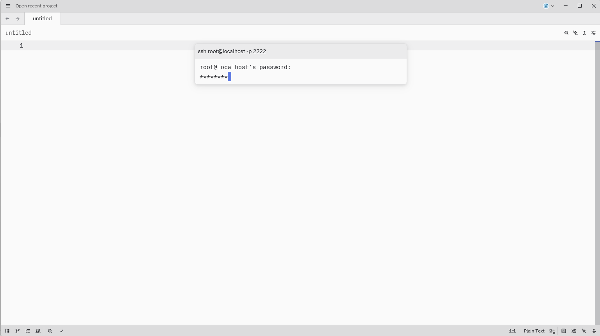
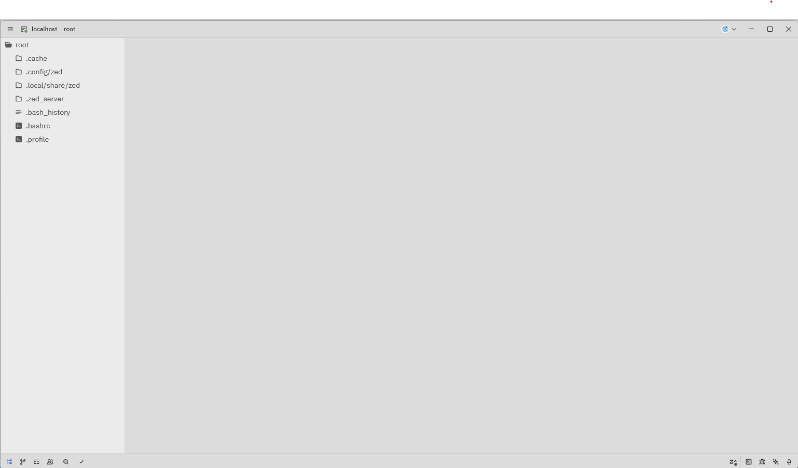

## はじめに

Zedは、Atomの開発者たちが新たに作り出したRust製の高速・軽量エディタとして注目を集めています。最近になってWindowsでも使えるようになりました。

しかし、開発環境をセキュアに保ちたい場合、直接ホストOSやWSL上でも動作させるのは避けたいところ。そこで今回は、以下の選択肢の中からDocker Containerを使用した開発環境の構築例を示します。

- Windows直接インストール
- WSL2での実行
- Docker Container on WSL2（今回採用）

:::message
本来であればDevcontainerを使用したかったのですが、現時点（2025年10月時点）ではZedがDevcontainerに対応していないため、今回はDockerでコンテナ環境を立ち上げ、直接ssh接続する方法を採用しています。
:::

## 前提環境と構成図

### 自分の環境
- Windows 11 Home
- WSL2
- Docker Engine on WSL2

## Containerの準備

以下のDockerfileを使用して開発環境を構築します：

```dockerfile
# ベースイメージ
FROM ubuntu:22.04

# 必要パッケージのインストール
RUN apt-get update && \
    apt-get install -y openssh-server && \
    mkdir /var/run/sshd

# rootのパスワードを設定（デモ用、実運用では鍵認証推奨）
RUN echo 'root:rootpass' | chpasswd

# rootログインを許可（必要な場合のみ）
RUN sed -i 's/#PermitRootLogin prohibit-password/PermitRootLogin yes/' /etc/ssh/sshd_config

# SSHがコンテナ内でフォアグラウンドで動くようにする
CMD ["/usr/sbin/sshd", "-D"]

# SSHポートを公開
EXPOSE 22
```

コンテナのビルドと起動：

```bash
# イメージのビルド
docker build -t ssh-demo .

# コンテナの起動
docker run -d --name ssh-server -p 2222:22 ssh-demo
```

これでホストの localhost:2222 にSSHでアクセスできます。

## ZedからSSHを開く

1. Zedを起動し、「File」→「Open Remote Project」を選択
2. 以下の形式でSSH設定を入力：

```bash
ssh root@localhost -p 2222
```




3. 接続後、`/root`ディレクトリが表示され、開発を開始できます。



## まとめと感想

### Zed + Dockerのメリット
- ZedがWindowsで使える!!
- 起動がとっても速い!!

### 今後の展望

#### Devcontainerへの期待
現状はDockerを直接使用していますが、やはりDevcontainerが使いたいところです。早く対応してくれることを祈ります。

#### 今後試してみたいこと
- Podmanを使用した環境構築

まだまだ展途上の部分も多いZedですが、非常に期待できるところが多いエディタだと感じています。

これからメインで使っていきたいです。
